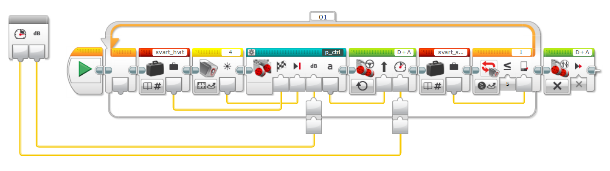

# MyBlocks i navigasjon.ev3

Under vises en tabell med de MyBlocks som TechnoBuilders har laget for FLL 2021. Noen av blokkene bruker kalibreringsverdier lagret i variabler som vist i tabellen. Det er verdier for hvor lite reflektert lys som skal til for å stoppe og hvor mye reflektert lys det er når sensoren står midt over skillet mellom sort og hvit. Tabellen viser også hvilke av blokkene som er tenkt brukt alene eller som hjelpeblokk inne i andre blokker.

| MyBlock          | Brukes      | svart_hvit | svart_stop |
|------------------|-------------|------------|------------|
| LF_R_stop_L      | Alene       |     X      |     X      |
| LF_L_stop_R      | Alene       |     X      |     X      |
| LF_R_stop_dist   | Alene       |     X      |            |
| LF_L_stop_dist   | Alene       |     X      |            |
| drive_fwd_stop_r | Alene       |            |     X      |
| drive_fwd_stop_L | Alene       |            |     X      |
| drive_dist       | Alene       |            |            |
| vri_grader       | Alene       |            |            |
| trippteller      | Hjelpeblokk |            |            |
| p_ctrl           | Hjelpeblokk |            |            |

## LF_R_stop_L - Line Follower Right Stop Left

Linjefølger som følger strek med høyre sensor. Stopper når venstre sensor ser svart.
#### Input
* Speed
* kP som sier hvor aggresiv styringen skal være.

## LF_L_stop_R - Line Follower Left Stop Right

Linjefølger som følger strek med venstre sensor. Stopper når høyre sensor ser svart.
#### Input
* Speed
* kP som sier hvor aggresiv styringen skal være.

## LF_R_stop_dist - Line Follower Right Stop Distance

Linjefølger som følger strek med høyre sensor. Stopper etter gitt avstand.
#### Input
* Speed
* kP - Hvor aggresiv styringen skal være.
* cm - Hvor langt skal roboten kjøre før den stopper

## LF_L_stop_dist - Line Follower Left Stop Distance

Linjefølger som følger strek med venstre sensor. Stopper etter gitt avstand.
#### Input
* Speed
* kP - Hvor aggresiv styringen skal være.
* cm - Hvor langt skal roboten kjøre før den stopper

## drive_fwd_stop_r - Drive Forward Stop Right

Kjører rett fram, stopper når høyre sensor ser svart.
#### Input
* Speed

## drive_fwd_stop_L - Drive Forward Stop Left

Kjører rett fram, stopper når venstre sensor ser svart.
#### Input
* Speed

## drive_dist - Drive Distance

kjører gitt antall cm. Kan også svinge.
#### Input
* Speed
* cm - Hvor langt skal roboten kjøre før den stopper
* Steering - Tall som angir styring. 0 er rett frem.

## vri_grader - Vri Grader

Vrir roboten gitt antall grader.
#### Input
* Grader - Hvor mange grader skal roboten vris. Positivt tall er med klokken.
* kP - Hvor aggresiv styringen skal være.

## trippteller - Trippteller

Hjelpeblokk som brukes til stopp på rett avstand. Regner gjennomsnittsverdien på høyre og venstre kjøremotor.
#### Output
* gjennomsnitt - Gjennomsnitt av hvor mange grader høyre og venstre hjul har rotert siden oppstart.

## p_ctrl - Proportional Controller

Prpposjonal kontroller til bruk i blant annet linjefølger.
#### Input
* target - Ønsket sensorverdi
* current - Målt sensorverdi
* kP - Hvor aggresiv korreksjon skal gjøres

#### Output
* steering - Tall som gir hastighet eller styreretning på motor som skal styres.
